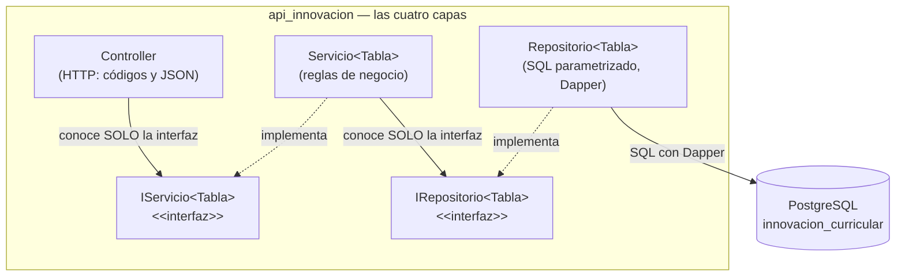

# Constitución del proyecto

> **Documento permanente.** Estas reglas rigen TODAS las entregas del
> módulo de innovación curricular. Cada entrega tiene además su propia
> especificación en [versiones/](versiones/); ante conflicto, la
> constitución gana.

---

## Artículo 1 — El proyecto es POR ENTREGAS y la especificación manda

- El sistema se construye por **entregas incrementales** (Entrega 1,
  Entrega 2, …), cada una con su spec kit propio (documentos 2 a 8). Una
  entrega está TERMINADA solo cuando pasa sus criterios de aceptación;
  entonces se hace commit, se sube al repositorio, y solo después se
  escribe la spec de la siguiente.
- **No se anticipa** (**YAGNI** — "no lo vas a necesitar"): nada de
  tablas con llave foránea, autenticación, roles o dashboard antes de la
  entrega que los pida. El código de cada entrega solo puede nombrar lo
  que su spec nombra.
- El repositorio siempre contiene la **entrega en curso, funcionando**.

## Artículo 2 — Stack: C# y ASP.NET Core, con el SQL a la vista

- Lenguaje **C#** sobre **ASP.NET Core** (.NET 10): controladores con
  atributos, inyección de dependencias del framework, `async/await` en
  todo el acceso a datos.
- **SIN ORM de entidades** (sin Entity Framework): el SQL se escribe A
  MANO, visible y SIEMPRE parametrizado (`@parametro`, nunca concatenar
  valores). El ejecutor es **Dapper**: mapea fila→objeto pero JAMÁS
  genera SQL por nosotros.
- Frontend en **ASP.NET Core Razor Pages** — mismo lenguaje, sin
  introducir un segundo ecosistema (Node/npm) mientras ninguna spec lo
  pida.
- Paquetes externos permitidos en la Entrega 1 (y ninguno más sin que una
  spec lo pida): `Npgsql`, `Dapper`, `Swashbuckle.AspNetCore`.

## Artículo 3 — Arquitectura en capas con interfaces, desde el día 1

```
HTTP → Controller (valida el body contra la PETICIÓN del verbo → 400)
     → IServicio{Tabla}      (interfaz — reglas de negocio)
     → IRepositorio{Tabla}   (interfaz — el servicio no sabe cómo se guarda)
     → Repositorio{Tabla}    (Dapper, SQL a mano parametrizado)
     → la base de datos
```

- El controlador no toca SQL; el servicio no conoce HTTP; el repositorio
  no conoce HTTP ni reglas de negocio.
- **Solo el ensamblador** (`Program.cs`) conoce clases concretas — todo
  lo demás recibe interfaces por constructor.
- El negocio comunica problemas con excepciones (`ConflictoExcepcion` →
  400 · `NoEncontradoExcepcion` → 404) y el controlador las traduce a
  HTTP.



## Artículo 4 — Un solo comando

`docker compose up -d --build` deja TODO el sistema de la entrega en
curso funcionando: base de datos, API y frontend juntos. El código va
montado como volumen y corre con `dotnet watch`.

## Artículo 5 — La base de datos viene DADA

La BD `innovacion_curricular` la entrega el profesor en
`db/00_innovacion_curricular.pg.sql` (25 tablas) — se copia tal cual, no
se edita. Lo que una entrega necesite y el script no traiga (como la
columna `activo`) se agrega en un script **adicional y numerado** dentro
de `db/` (`01_alter_activo.sql`, `02_…`), nunca tocando el original.

## Artículo 6 — Todo en español, comentado para principiantes

Nombres, rutas, mensajes, comentarios y documentación: **en español**. El
código lleva comentarios explicando qué hace cada bloque — el repositorio
es también material de estudio del equipo.

## Artículo 7 — Contratos exactos

Los endpoints, formatos y códigos de estado de cada entrega están en su
`6_contracts.md` y se cumplen al pie de la letra. En la Entrega 1 solo
existe `PUT` (reemplazo completo, sin la llave primaria) — no se
implementa `PATCH`, porque ninguna spec lo pidió (Artículo 1).

## Artículo 8 — Convenciones fijas

| Cosa | Convención |
|---|---|
| Puertos | API **8080** · Frontend **8081** · PostgreSQL **15432** (mapeado del 5432 interno, para no chocar con un PostgreSQL local) |
| Rutas | `/` (diagnóstico) · `/swagger` (documentación interactiva) · `/api/{tabla}` (recurso REST) |
| Nombres | PascalCase en español; interfaces con prefijo `I`; carpetas `Controllers/ Modelos/ Peticiones/ Servicios/ Repositorios/ Excepciones/` |
| Sobre de respuesta | Lecturas: arreglo JSON directo · Errores de negocio: `{ "mensaje": "..." }` · Errores de validación del body: `ValidationProblemDetails` estándar de ASP.NET Core |
| Errores | Body inválido → **400** · `ConflictoExcepcion` (llave repetida) → **400** · `NoEncontradoExcepcion` → **404** · error no previsto → **500** |
| Llaves primarias | Las 22 tablas propias del módulo son `INT` sin autoincremento: el id/nit lo envía quien crea el registro (excepción: `usuario`, `rol`, `rol_usuario`, que sí son `SERIAL`) |
| Credenciales (didácticas) | BD: `postgres` / `Diseno123!` · base `innovacion_curricular` |
