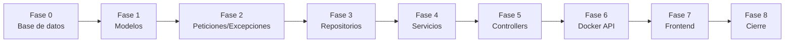

# 8_tasks.md — Entrega 1: catálogos sin llave foránea

Cada fase cubre las 7 tablas a la vez. No se avanza con la verificación
de la fase actual en rojo (Artículo 1).

| Fase | Tareas | Verificar |
|---|---|---|
| **0** — Base de datos | Copiar `00_...sql` del profesor · escribir `01_alter_activo.sql` · servicio `db` en `docker-compose.yml` | `docker exec -it innovacion_db psql -U postgres -d innovacion_curricular -c "\d area_conocimiento"` muestra la columna `activo` |
| **1** — Modelos | `.csproj` con Dapper/Npgsql/Swashbuckle · 7 clases en `Modelos/` | `dotnet build` sin errores |
| **2** — Peticiones/Excepciones | 7 `{Tabla}Peticiones.cs` con `[Required]`/`[MaxLength]` · `ExcepcionesNegocio.cs` | `dotnet build` sin errores |
| **3** — Repositorios | 7 interfaces + implementaciones Dapper, filtrando `activo = true` en lecturas | revisión manual: todo SQL usa `@parametros` (Artículo 2) |
| **4** — Servicios | 7 interfaces + implementaciones: id no repetido (D1), `NoEncontradoExcepcion` | `dotnet build` sin errores |
| **5** — Controllers | 7 Controllers con las rutas de `6_contracts.md` · `Program.cs` registra las 7 parejas Repositorio/Servicio | `dotnet build` sin errores dentro de `api_innovacion/` |
| **6** — Docker API | `Dockerfile` · servicio `api` en `docker-compose.yml` | `curl.exe http://localhost:8080/api/area_conocimiento` → `200` |
| **7** — Frontend | `.csproj` + `Program.cs` con `HttpClient` → `API_URL` · 7 Modelos espejo · 7 clientes HTTP · páginas Index/Crear/Editar ×7 · `_Layout.cshtml` · `Dockerfile` · servicio `frontend` | `http://localhost:8081/AreaConocimiento` carga sin error |
| **8** — Cierre | Correr completo `7_quickstart.md` · subir a los dos repos de GitHub, cada uno con rama por integrante | los 6 criterios de `2_spec.md` en verde; ambos repos con `main` + una rama por integrante |

## Estado real de esta entrega (actualizado al cierre)

**Fases 0 a 7:** completas.

**Fase 8 (smoke test formal, corrido en vivo sobre `area_conocimiento`):**

| Criterio (`2_spec.md`) | Resultado |
|---|---|
| 1 — Listar solo `activo = true` | ✅ pasa |
| 2 — Rechazar id duplicado (`400`) | ✅ pasa — confirmado con el mensaje exacto `{"mensaje":"ya existe un área de conocimiento con id 91"}` |
| 3 — Rechazar campo que excede su longitud (`400`) | ✅ pasa |
| 4 — Ciclo crear → editar → confirmar el cambio | ✅ pasa (ver bug corregido abajo) |
| 5 — Eliminar es lógico, no físico | ✅ pasa — verificado por `GET` (404 tras eliminar) y por SQL directo (`activo = false`, la fila sigue existiendo) |
| 6 — El frontend completa el ciclo sin Swagger | ✅ pasa |

**Bug encontrado y corregido durante el smoke test:** ver la entrada D8 en
`4_research.md`.

**Repositorios de GitHub:** `api-innovacion-curricular` y
`frontend-innovacion-curricular`, ambos con rama `main` y rama por
integrante. La versión queda etiquetada con `git tag v1` en el
repositorio de la API al cierre de este documento.
